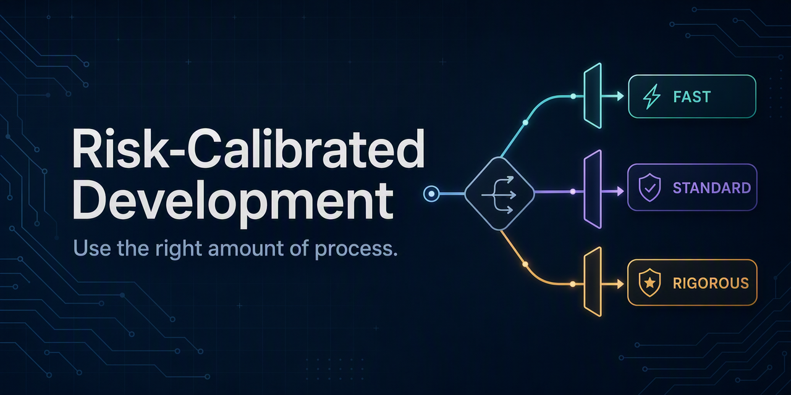

<div align="center">
  <h1>Risk-Calibrated Development</h1>
  <p></p>
  <p><strong>根据软件变更的真实风险，选择恰当的设计、测试、审查和交付流程。</strong></p>
  <p><a href="README.md">English</a> | <a href="README.zh-CN.md">简体中文</a></p>
  <p>
    
    
    
    
  </p>
</div>

Risk-Calibrated Development 帮助 Coding Agent 使用恰到好处的工程流程：既不是流程越多越好，也不是流程越少越好。

## 核心主张

> 在剩余风险可接受的前提下，使用成本最低的开发流程。

```text
所需保障强度
= 失败概率
× 影响程度
× 恢复难度
× 不确定性
```

## 背景

Coding Agent 经常对所有任务套用同一套重量级工作流。

一处小的间距修改可能触发头脑风暴、设计审批、测试驱动开发、完整测试套件、Docker 重建、代码审查和部署准备。与此同时，一行权限或生产配置修改看起来很简单，却可能带来显著的运行风险。

Risk-Calibrated Development 用来解决这种错配。它根据变更后果、可回滚性和不确定性进行分类，而不是根据代码量、文件数量或预估工作量判断风险。

## 解决的问题

- 简单 UI 修改被过度设计和验证。
- 多个流程 Skill 同时触发，造成重复工作。
- 文件数量或代码行数被错误地当作风险指标。
- 每个小改动都重复执行构建、Docker、提交或部署准备。
- 创建新代码前，没有优先复用框架和项目已有能力。
- 真正高风险的一行配置修改反而可能被低估。
- Agent 经常为了“更保险”执行与当前风险无关的检查。

## 设计目标

- 让流程成本与真实风险成比例。
- 默认从轻量流程开始，仅根据证据升级。
- 为低风险修改提供快速、直接的执行路径。
- 为数据、安全和生产变更保留严格保障。
- 让每项验证都对应一个明确风险。
- 优先使用框架、依赖和项目已有能力。
- 避免无关重构、重复验证和流程叠加。
- 保持代码修改、Git 交付和生产部署之间的授权边界。

## 工作原理

这个 Skill 是一个定性风险路由器，通过核心主张中的四个因素判断所需流程：

| 因素 | 需要回答的问题 |
| --- | --- |
| 失败概率 | 变更出现错误行为的可能性有多大？ |
| 影响程度 | 哪些用户、系统、契约或数据可能受到影响？ |
| 恢复难度 | 变更能否轻松回滚或修复？ |
| 不确定性 | 对问题原因、预期行为和受影响边界的理解是否充分？ |

面对每项任务时，这个 Skill 会：

1. 从 **Fast** 开始。
2. 检查是否存在需要升级到 **Standard** 或 **Rigorous** 的可观察信号。
3. 选择能够将残余风险控制在可接受范围内的最小工作流。
4. 创建新实现前，优先复用平台和项目已有能力。
5. 只执行覆盖已识别风险所需的验证。

## 风险等级

### Fast

适用于明确、局部、容易回滚的修改，例如：

- 文案、间距、颜色或图标
- 局部布局
- 已有组件的小幅调整

默认行为：

- 直接实施。
- 检查目标实现和既有模式。
- 审查 diff。
- 执行最小范围的静态检查或 UI 验证。
- 不自动增加设计审批、TDD、Docker、完整构建、Git 交付或部署。

### Standard

适用于局部业务行为变化或具有一定不确定性的修改，例如：

- 表单和状态管理
- 单个 API
- 共享组件
- 依赖或配置调整
- 原因尚未确定的 Bug
- 影响多个页面的交互修改

默认行为：

- 先确认根因和受影响契约。
- 在职责合理时复用已有实现。
- 执行针对性测试。
- 运行受影响范围的 lint 或类型检查。
- 仅在无法推断实质性产品选择时询问用户。

### Rigorous

适用于具有明确高风险特征的修改，例如：

- 数据库结构和数据迁移
- 批量数据修改
- 登录、权限和安全
- 隐私、密钥和计费
- 公开 API 或外部契约
- 生产基础设施
- 难以回滚或影响范围广泛的操作

默认行为：

- 修改前确认设计和风险。
- 明确迁移、回滚和停止条件。
- 对可测试的行为建立可靠测试。
- 执行完整且相关的工程验证。
- 在获得部署授权后，对生产变更执行部署后验证。

完整决策规则请查看 [SKILL.md](skills/risk-calibrated-development/SKILL.md)。

## 典型案例

| 变更 | 分类 | 关键原因 |
| --- | --- | --- |
| 将按钮间距从 `8px` 改为 `12px` | Fast | 局部、明确、可逆 |
| 编辑文章返回后恢复分页状态 | Standard | 涉及路由和页面状态 |
| 修改十几个语言文件的按钮文案 | Fast | 文件数量不代表高风险 |
| 将新用户默认角色改为管理员 | Rigorous | 权限与安全风险 |
| 批量发布历史草稿 | Rigorous | 生产数据批量修改 |
| 修改公开 API 默认排序 | Rigorous | 外部契约和分页稳定性 |

示例提示词：

```text
使用 $risk-calibrated-development，将按钮间距从 8px 改为 12px。
使用 $risk-calibrated-development，编辑文章返回后保留原分页状态。
使用 $risk-calibrated-development，修改新用户的默认角色。
```

## 安装

克隆仓库，并将 Skill 复制到 Agent 环境中。以 Codex 为例：

```bash
git clone https://github.com/DangJin/risk-calibrated-development.git
mkdir -p ~/.codex/skills
cp -R risk-calibrated-development/skills/risk-calibrated-development ~/.codex/skills/
```

如果 Agent 环境不能自动发现新安装的 Skill，请重新启动该环境。

## 使用

在提示词中显式调用：

```text
使用 $risk-calibrated-development，以与风险相匹配的流程和验证方式实现这项变更。
```

兼容的 Agent 环境也可以自动调用该 Skill。仓库包含的 OpenAI Agent 配置已允许隐式调用。

## 能力复用顺序

每次创建新实现前，依次检查：

```text
平台 / 框架 / 标准库 / 依赖
→ 项目已有实现
→ 扩展已有能力
→ 创建本地实现
→ 引入外部依赖
```

找到满足需求且职责边界合理的方案后，即可停止搜索。

## 与其他 Skill 的关系

Risk-Calibrated Development 是流程路由器，而不是领域 Skill 的替代品。

图片、文档、Figma、浏览器控制和特定框架 Skill 仍然正常使用。头脑风暴、TDD、实施计划、Worktree、代码审查和完整验证等流程能力，则根据风险等级选择。用户明确指定的流程始终优先。

## 交付边界

这个 Skill 将以下操作视为独立的授权边界：

- 修改代码
- 更新本地服务或 Docker
- Commit、Push 或创建 Pull Request
- 部署到生产环境

“开始修改”不会自动扩大为提交、推送或部署。用户明确要求完整交付时，则在所请求范围的最终阶段统一执行重复构建和部署。

## 非目标

这个 Skill 不负责：

- 替代项目自己的工程规范
- 降低必要的安全和数据保障
- 强制所有项目使用相同测试工具
- 为每个任务生成设计文档
- 自动授权 Git、部署或生产数据操作
- 管理纯研究、文案或只读分析任务

## 项目定位

> This is not a “skip the process” skill. It is a “use the right amount of process” skill.

它的目标不是让 Coding Agent 永远选择最快路径，而是减少无效流程，同时保留与真实风险相匹配的工程保障。

## 仓库结构

```text
skills/
└── risk-calibrated-development/
    ├── SKILL.md
    └── agents/
        └── openai.yaml
```

## 支持与贡献

请通过 [GitHub Issues](https://github.com/DangJin/risk-calibrated-development/issues) 报告问题或提出改进建议。Pull Request 应保持流程适度、结果可复现，并与现有 Skill 契约兼容。

维护者：[@DangJin](https://github.com/DangJin)。

## 许可证

本项目目前未授予任何许可证。在添加许可证文件前，保留所有权利。
